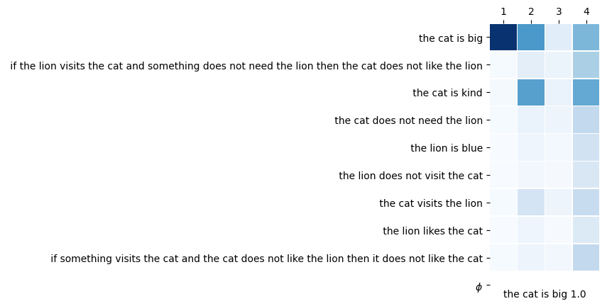

# From Symbolic Logic Reasoning to Soft Reasoning: A Neural-Symbolic Paradigm
This repository contains the code for the poster [From Symbolic Logic Reasoning to Soft Reasoning: A Neural-Symbolic Paradigm](https://www.researchgate.net/publication/356695884_From_Symbolic_Logic_Reasoning_to_Soft_Reasoning_A_Neural-Symbolic_Paradigm). The goal is to build up an end-to-end neural based reasoning engine. The existing neural based models lack a reasoning engine, and they are not end-to-end training process. The repository also incorporates extra code for research as part of future work.

## Dataset
All the current work data is using the [PARARULE](https://allenai.org/data/ruletaker) from Allen AI institute. The dataset has been published on [Transformers as Soft Reasoners over Language](https://arxiv.org/abs/2002.05867), [CONCEPTRULES V1](https://drive.google.com/file/d/1lxoAvtcvqVCYiO8e3tENnrTQ1NNVtpjs/view?usp=sharing) and [CONCEPTRULES V2](https://drive.google.com/file/d/1lOCbW8bfZxj1RIzKDxn8xKg99XyYNj7z/view?usp=sharing) from [Tim Hartill](https://github.com/timhartill).

## Word-level Embedding
The word vector representation is based on [GloVe](https://nlp.stanford.edu/projects/glove/). In this paper, we use [glove.6B.zip](http://nlp.stanford.edu/data/glove.6B.zip).

[glove.6B.zip](http://nlp.stanford.edu/data/glove.6B.zip)

[glove.42B.300d.zip](http://nlp.stanford.edu/data/glove.42B.300d.zip)

[glove.840B.300d.zip](http://nlp.stanford.edu/data/glove.840B.300d.zip)


## Training
There is a training script `train.py` that encapsulates training models defined in `models` directory. The models are built using [Keras](https://keras.io/) and [TensorFlow](https://www.tensorflow.org/) which can be installed using:

```bash
pip3 install --no-cache-dir --upgrade -r requirements.py
```

The model can be trained using:
```bash
# Usage
python3 train_pararule.py -h

usage: train_pararule.py [-h] [-md MODEL_DIR] [--dim DIM] [-d]
                [-ts [TASKS [TASKS ...]]] [-e EPOCHS] [-s] [-i]
                [-its ITERATIONS] [-bs BATCH_SIZE] [-p]
                model model_file

Train logic-memnn models.

positional arguments:
  model                 The name of the module to train.
  model_file            Model filename.

optional arguments:
  -h, --help            show this help message and exit
  -md MODEL_DIR, --model_dir MODEL_DIR
                        Model weights directory ending with /.
  --dim DIM             Latent dimension.
  -d, --debug           Only predict single data point.
  -ts [TASKS [TASKS ...]], --tasks [TASKS [TASKS ...]]
                        Tasks to train on, blank for all tasks.
  -e EPOCHS, --epochs EPOCHS
                        Number of epochs to train.
  -s, --summary         Dump model summary on creation.
  -i, --ilp             Run ILP task.
  -its ITERATIONS, --iterations ITERATIONS
                        Number of model iterations.
  -bs BATCH_SIZE, --batch_size BATCH_SIZE
                        Training batch_size.
  -p, --pad             Pad context with blank rule.

# Example training
mkdir weights

# train imasm_glove on pararule
python3 train_pararule.py imasm_glove curr_imasm64
```

There is also an interactive debug mode and the corresponding attention maps along with the output is displayed. This feature is useful for understanding the iterative steps and interpreting the attention maps.
```bash
# same command as before but add -d for debug, can also change iterations
python3 train_pararule.py imasm_glove curr_imasm64 -p -d
# or if you have trained a model and want to use that trained model to do the debug operation and show the metrics, you can use the following command.
python3 train_pararule.py imasm_glove curr_imasm64 -p --model_dir ./weights/ -d

CTX: Red things are big. Anne is big. Erin is green. Anne is red. All red things are round. If something is green and cold then it is furry. Anne is green. Anne is cold. Erin is round. If something is rough then it is furry. If something is cold then it is furry. Anne is rough. Anne is furry. All furry things are round. Erin is furry. Erin is cold. If something is round then it is rough. All rough things are cold.
Q: Anne is red.
[[0.42452598 0.3956099  0.41401926 0.41186276 0.43142602 0.42232043
  0.4404202  0.43397516 0.35751885]]
[[0.51418716 0.48395082 0.50294954 0.49070144 0.55595106 0.5309455
  0.52362514 0.54792887 0.44554162]]
[[0.84132403 0.79714227 0.8344899  0.8214849  0.8301918  0.8159419
  0.8399015  0.8236064  0.7794838 ]]
[[0.8581093  0.8581093  0.8581093  0.8581093  0.8581089  0.85810924
  0.8581093  0.8581091  0.8581093 ]]
[[1.]]
OUT: 1.0

```


## Evaluating
Similar to training, there is a corresponding `eval_pararule.py` script that runs the models on the evaluation / test data as well as plots charts such as attention maps. It can be used as follows:
```bash
# Usage
python3 eval_pararule.py

usage: eval_pararule.py [-h] [-md MODEL_DIR] [--dim DIM] [-f FUNCTION] [--outf OUTF]
               [-s] [-its ITERATIONS] [-bs BATCH_SIZE] [-p]
               model model_file

Evaluate logic-memnn models.

positional arguments:
  model                 The name of the module to train.
  model_file            Model filename.

optional arguments:
  -h, --help            show this help message and exit
  -md MODEL_DIR, --model_dir MODEL_DIR
                        Model weights directory ending with /.
  --dim DIM             Latent dimension.
  -f FUNCTION, --function FUNCTION
                        Function to run.
  --outf OUTF           Plot to output file instead of rendering.
  -s, --summary         Dump model summary on creation.
  -its ITERATIONS, --iterations ITERATIONS
                        Number of model iterations.
  -bs BATCH_SIZE, --batch_size BATCH_SIZE
                        Evaluation batch_size.
  -p, --pad             Pad context with blank rule.

# If the evaluation data is generated
python3 eval_pararule.py imasm_glove curr_imasm64 # will evaluate on data folder

# Example to plot attention map
python3 eval_pararule.py imasm_glove curr_imasm64 -f plot_attention
```

#### Depth-0 reasoning attention map



## Built With

 - [Keras](https://keras.io/) - library used to implement models
 - [TensorFlow](https://www.tensorflow.org/) - library used to train and run models
 - [Matplotlib](https://matplotlib.org/) - main plotting library
 - [seaborn](https://seaborn.pydata.org/) - helper plotting library for some charts
 - [NumPy](http://www.numpy.org/) - main numerical library for data vectorisation
 - [Pandas](https://pandas.pydata.org/) - helper data manipulation library
 
 ## Citation
```
@InProceedings{
  title={From Symbolic Logic Reasoning to Soft Reasoning: A Neural-Symbolic Paradigm},
  author={Qiming Bao, Michael Witbrock, Jiamou Liu},
  year={2021},
  publisher={New Zealand Workshop on Artificial Intelligence Research},
  DOI={10.13140/RG.2.2.25972.68485}
}
```

 ## Acknowledgement
 Thanks to the author of the [DeepLogic: Towards End-to-End Differentiable Logical Reasoning](https://github.com/nuric/deeplogic), for his advice and help in understanding and reproducing his work. This is of great help to me in completing this research and future research. Also Thanks [Tim Hartill](https://github.com/timhartill) who developed CONCEPTRULES V1 and CONCEPTRULES V2 datasets.
 
 Thanks to the help from [FacebookAI: fairseq](https://github.com/pytorch/fairseq) for my replication to the experiment result from [Transformers as Soft Reasoners over Language](https://arxiv.org/abs/2002.05867). Here is my replication notes [Finetuning RoBERTa on RACE tasks](https://github.com/14H034160212/fairseq/blob/master/examples/roberta/README.race.md) to the [Transformers as Soft Reasoners over Language](https://arxiv.org/abs/2002.05867).
 
 ## Other links
[DMN+] Dynamic Memory Networks for Visual and Textual Question Answering
https://arxiv.org/abs/1603.01417

[DMN] Ask Me Anything: Dynamic Memory Networks for Natural Language Processing 
https://arxiv.org/abs/1506.07285

[Hyperas] Bayesian optimization of automated hyperparameter tuning
https://github.com/maxpumperla/hyperas

[MemN2N] End-To-End Memory Networks
https://arxiv.org/abs/1503.08895

[MemN2N implementation on bAbI tasks with very nice interactive demo] End-To-End Memory Networks for Question Answering
https://github.com/14H034160212/MemN2N-babi-python

Memory Networks
https://arxiv.org/pdf/1410.3916.pdf
